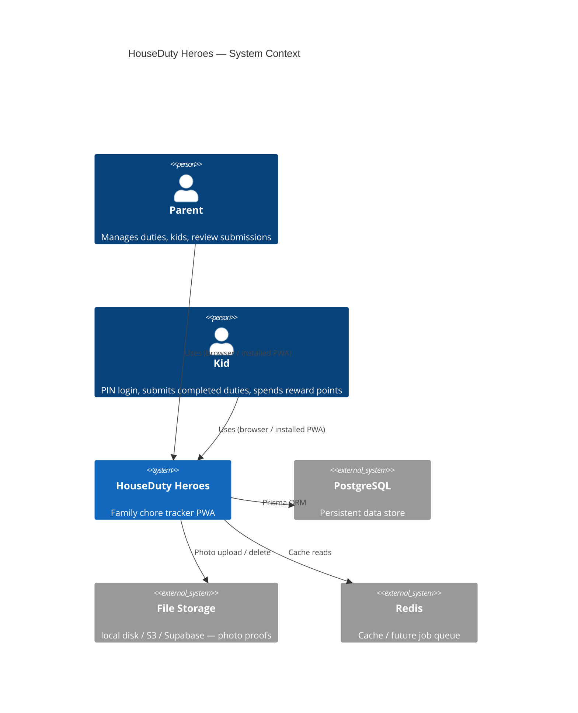
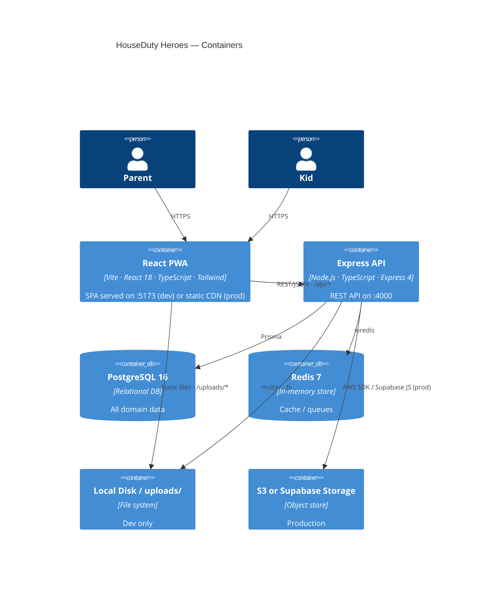
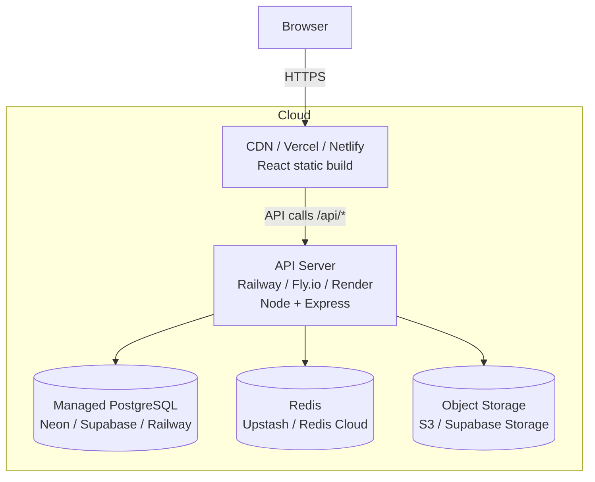

# Architecture

## System Context



## Container Diagram



## Tech Stack

| Layer | Technology | Notes |
|---|---|---|
| Frontend | React 18 + Vite + TypeScript | |
| Styling | Tailwind CSS 3 | Custom brand palette in `tailwind.config.js` |
| State | Zustand | `authStore` + per-screen local state |
| PWA | vite-plugin-pwa | Service worker, offline NetworkFirst cache |
| Routing | React Router v6 | Protected routes for PARENT / KID roles |
| Backend | Node.js + Express 4 + TypeScript | `tsx` for dev, compiled for prod |
| ORM | Prisma 5 | Migrations in `packages/server/prisma/` |
| Database | PostgreSQL 16 | Docker locally, any managed PG in cloud |
| Auth | JWT (parents) + bcrypt PIN (kids) | `jsonwebtoken` + `bcryptjs` |
| Validation | Zod | Request body parsing on all routes |
| File upload | multer (v1 → upgrade to v2 recommended) | |
| Storage | Abstract provider pattern | `STORAGE_PROVIDER=local|s3|supabase` |
| Cache | Redis 7 | Docker locally, Redis Cloud / Upstash in prod |
| Monorepo | npm workspaces | `packages/server` + `packages/client` |
| Infra (local) | Docker Compose | `docker-compose.yml` |

## Deployment Topology (Cloud-ready)



### Environment variables to swap for production

```
DATABASE_URL=postgresql://...       # managed PG connection string
JWT_SECRET=<strong-random>
STORAGE_PROVIDER=s3                 # or supabase
S3_BUCKET=houseduty-photos
S3_REGION=us-east-1
REDIS_URL=redis://...
CLIENT_URL=https://yourapp.com
PHOTO_RETENTION_DAYS=30
```
