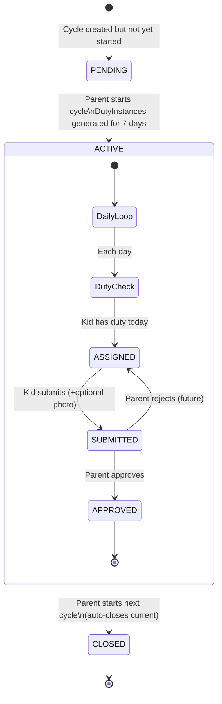
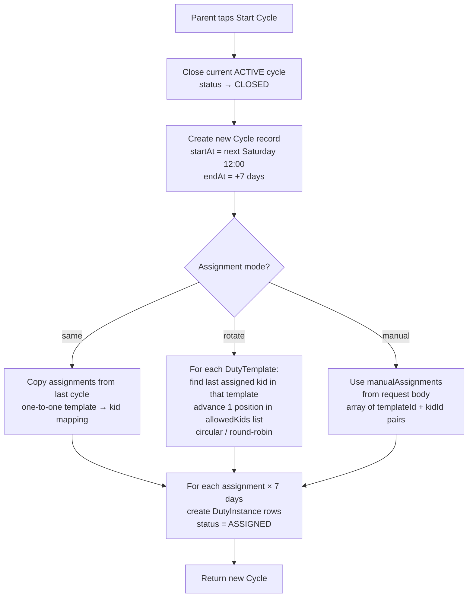
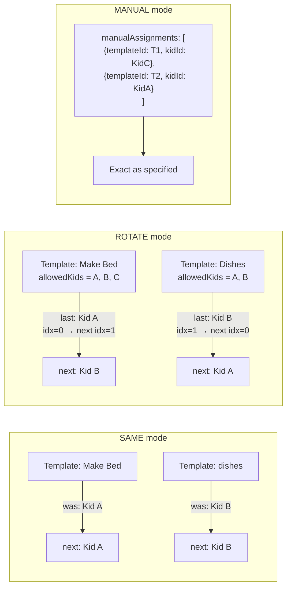
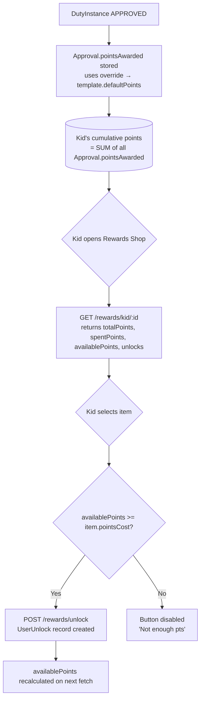
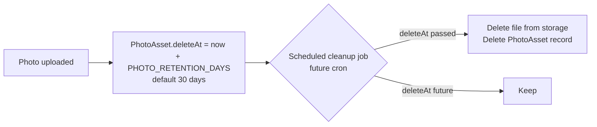

# Duty Cycle Logic

## Cycle Lifecycle



## Cycle Start / Assignment Ceremony



## Assignment Mode Detail



## Duty Instance States per Day

```mermaid
flowchart LR
    AS([ASSIGNED\n📋 Kid sees it]) -->|Kid submits| SU([SUBMITTED\n⏳ Parent notified])
    SU -->|Parent approves| AP([APPROVED\n✅ Points awarded])
    SU -.->|Parent rejects (future)| AS
    AP -->|End of cycle| CL([Cycle CLOSED\nCounted in summary])
```

## Points & Rewards Flow



## Photo Retention Policy


