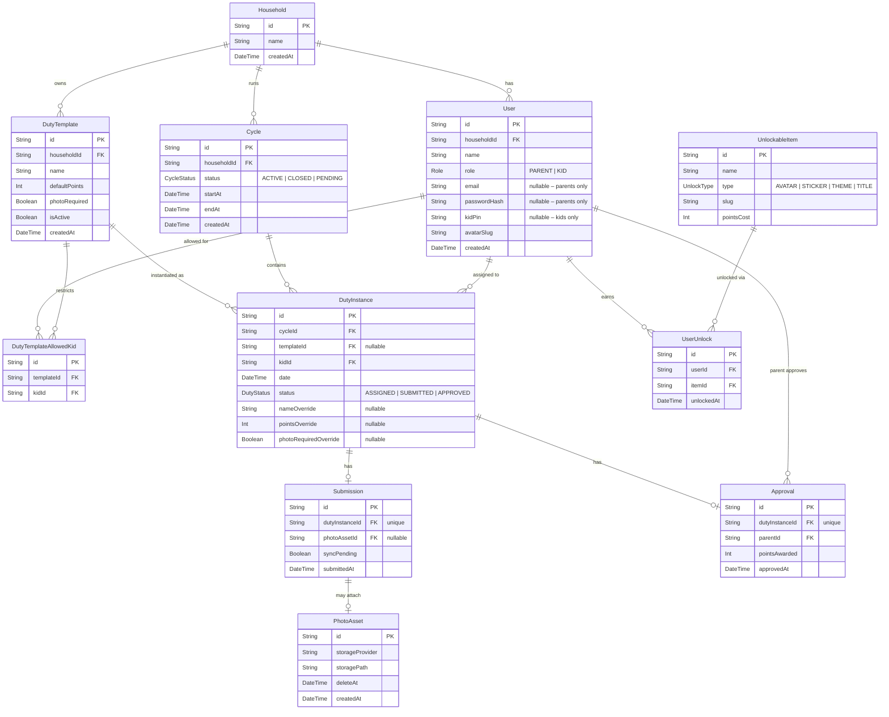
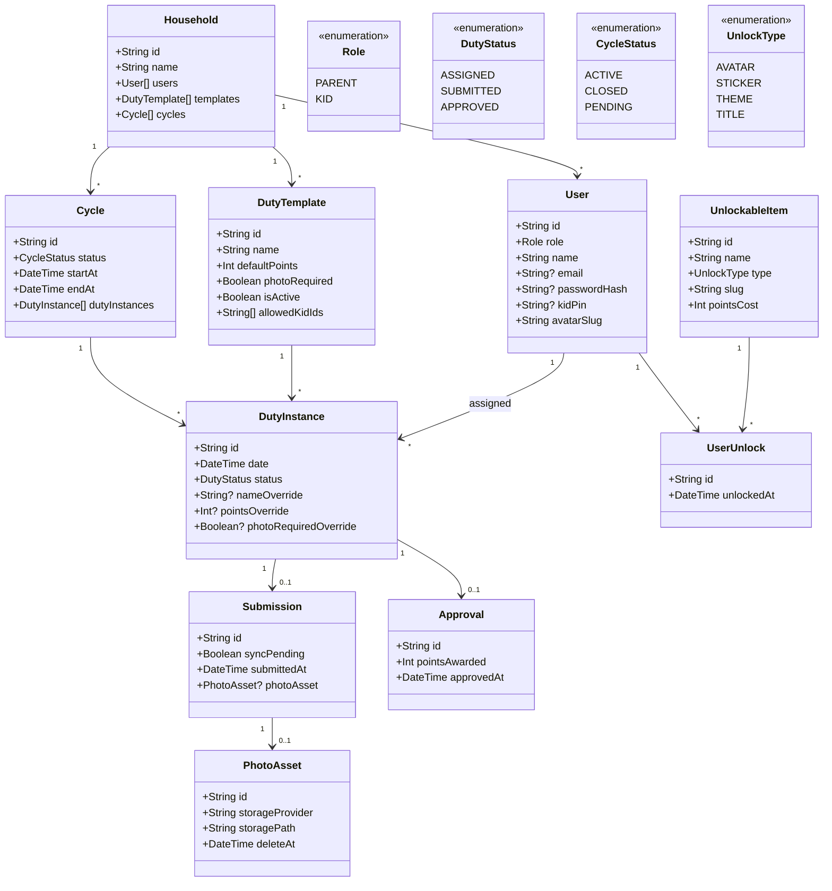
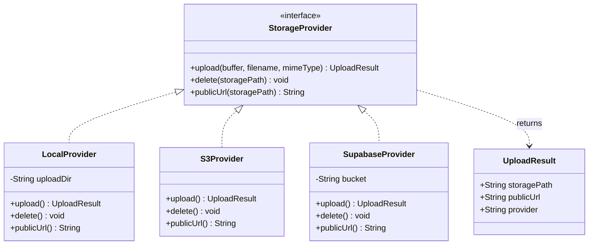

# Data Model

## Entity-Relationship Diagram

```mermaid
erDiagram
    Household {
        String id PK
        String name
        DateTime createdAt
    }
    User {
        String id PK
        String householdId FK
        String name
        Role role "PARENT | KID"
        String email "nullable – parents only"
        String passwordHash "nullable – parents only"
        String kidPin "nullable – kids only"
        String avatarSlug
        DateTime createdAt
    }
    DutyTemplate {
        String id PK
        String householdId FK
        String name
        Int defaultPoints
        Boolean photoRequired
        Boolean isActive
        DateTime createdAt
    }
    DutyTemplateAllowedKid {
        String id PK
        String templateId FK
        String kidId FK
    }
    Cycle {
        String id PK
        String householdId FK
        CycleStatus status "ACTIVE | CLOSED | PENDING"
        DateTime startAt
        DateTime endAt
        DateTime createdAt
    }
    DutyInstance {
        String id PK
        String cycleId FK
        String templateId FK "nullable"
        String kidId FK
        DateTime date
        DutyStatus status "ASSIGNED | SUBMITTED | APPROVED"
        String nameOverride "nullable"
        Int pointsOverride "nullable"
        Boolean photoRequiredOverride "nullable"
    }
    Submission {
        String id PK
        String dutyInstanceId FK "unique"
        String photoAssetId FK "nullable"
        Boolean syncPending
        DateTime submittedAt
    }
    Approval {
        String id PK
        String dutyInstanceId FK "unique"
        String parentId FK
        Int pointsAwarded
        DateTime approvedAt
    }
    PhotoAsset {
        String id PK
        String storageProvider
        String storagePath
        DateTime deleteAt
        DateTime createdAt
    }
    UnlockableItem {
        String id PK
        String name
        UnlockType type "AVATAR | STICKER | THEME | TITLE"
        String slug
        Int pointsCost
    }
    UserUnlock {
        String id PK
        String userId FK
        String itemId FK
        DateTime unlockedAt
    }

    Household ||--o{ User : "has"
    Household ||--o{ DutyTemplate : "owns"
    Household ||--o{ Cycle : "runs"
    User ||--o{ DutyTemplateAllowedKid : "allowed for"
    DutyTemplate ||--o{ DutyTemplateAllowedKid : "restricts"
    DutyTemplate ||--o{ DutyInstance : "instantiated as"
    Cycle ||--o{ DutyInstance : "contains"
    User ||--o{ DutyInstance : "assigned to"
    DutyInstance ||--o| Submission : "has"
    DutyInstance ||--o| Approval : "has"
    Submission ||--o| PhotoAsset : "may attach"
    User ||--o{ Approval : "parent approves"
    User ||--o{ UserUnlock : "earns"
    UnlockableItem ||--o{ UserUnlock : "unlocked via"
```

## Class Diagram (domain objects)

```mermaid
classDiagram
    class Household {
        +String id
        +String name
        +User[] users
        +DutyTemplate[] templates
        +Cycle[] cycles
    }
    class User {
        +String id
        +Role role
        +String name
        +String? email
        +String? passwordHash
        +String? kidPin
        +String avatarSlug
    }
    class DutyTemplate {
        +String id
        +String name
        +Int defaultPoints
        +Boolean photoRequired
        +Boolean isActive
        +String[] allowedKidIds
    }
    class Cycle {
        +String id
        +CycleStatus status
        +DateTime startAt
        +DateTime endAt
        +DutyInstance[] dutyInstances
    }
    class DutyInstance {
        +String id
        +DateTime date
        +DutyStatus status
        +String? nameOverride
        +Int? pointsOverride
        +Boolean? photoRequiredOverride
    }
    class Submission {
        +String id
        +Boolean syncPending
        +DateTime submittedAt
        +PhotoAsset? photoAsset
    }
    class Approval {
        +String id
        +Int pointsAwarded
        +DateTime approvedAt
    }
    class PhotoAsset {
        +String id
        +String storageProvider
        +String storagePath
        +DateTime deleteAt
    }
    class UnlockableItem {
        +String id
        +String name
        +UnlockType type
        +String slug
        +Int pointsCost
    }
    class UserUnlock {
        +String id
        +DateTime unlockedAt
    }

    Household "1" --> "*" User
    Household "1" --> "*" DutyTemplate
    Household "1" --> "*" Cycle
    Cycle "1" --> "*" DutyInstance
    DutyTemplate "1" --> "*" DutyInstance
    User "1" --> "*" DutyInstance : assigned
    DutyInstance "1" --> "0..1" Submission
    DutyInstance "1" --> "0..1" Approval
    Submission "1" --> "0..1" PhotoAsset
    User "1" --> "*" UserUnlock
    UnlockableItem "1" --> "*" UserUnlock

    class Role {
        <<enumeration>>
        PARENT
        KID
    }
    class DutyStatus {
        <<enumeration>>
        ASSIGNED
        SUBMITTED
        APPROVED
    }
    class CycleStatus {
        <<enumeration>>
        ACTIVE
        CLOSED
        PENDING
    }
    class UnlockType {
        <<enumeration>>
        AVATAR
        STICKER
        THEME
        TITLE
    }
```

## Storage Provider Abstraction

```mermaid
classDiagram
    class StorageProvider {
        <<interface>>
        +upload(buffer, filename, mimeType) UploadResult
        +delete(storagePath) void
        +publicUrl(storagePath) String
    }
    class LocalProvider {
        -String uploadDir
        +upload() UploadResult
        +delete() void
        +publicUrl() String
    }
    class S3Provider {
        +upload() UploadResult
        +delete() void
        +publicUrl() String
    }
    class SupabaseProvider {
        -String bucket
        +upload() UploadResult
        +delete() void
        +publicUrl() String
    }
    class UploadResult {
        +String storagePath
        +String publicUrl
        +String provider
    }

    StorageProvider <|.. LocalProvider
    StorageProvider <|.. S3Provider
    StorageProvider <|.. SupabaseProvider
    StorageProvider ..> UploadResult : returns
```
