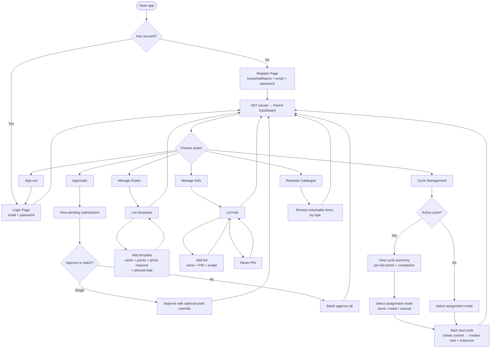
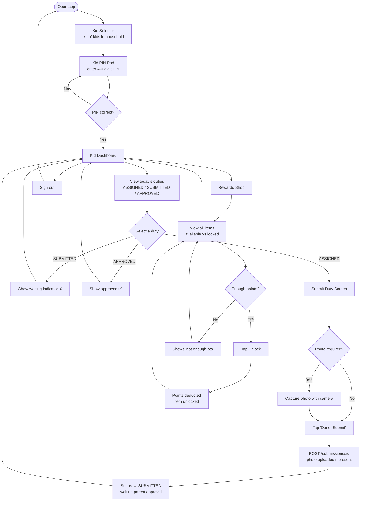
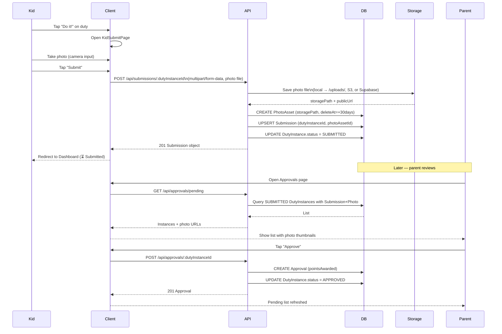
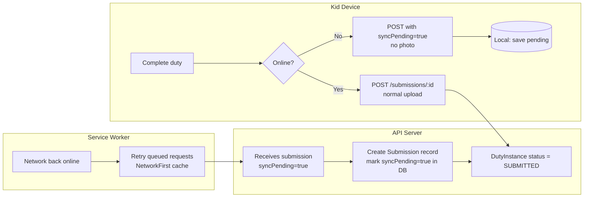

# User Flows

## Parent Journey

```mermaid
flowchart TD
    A([Open app]) --> B{Has account?}
    B -->|No| C[Register Page\nhouseholdName + email + password]
    B -->|Yes| D[Login Page\nemail + password]
    C --> E[JWT issued → Parent Dashboard]
    D --> E

    E --> F{Choose action}

    F --> G[Approvals]
    G --> G1[View pending submissions]
    G1 --> G2{Approve or batch?}
    G2 -->|Single| G3[Approve with optional point override]
    G2 -->|All| G4[Batch approve all]
    G3 --> E
    G4 --> E

    F --> H[Manage Duties]
    H --> H1[List templates]
    H1 --> H2[Add template\nname + points + photo required\n+ allowed kids]
    H2 --> H1
    H1 --> E

    F --> I[Manage Kids]
    I --> I1[List kids]
    I1 --> I2[Add kid\nname + PIN + avatar]
    I2 --> I1
    I1 --> I3[Reset PIN]
    I3 --> I1
    I1 --> E

    F --> J[Cycle Management]
    J --> J1{Active cycle?}
    J1 -->|Yes| J2[View cycle summary\nper-kid points + completion]
    J2 --> J3[Select assignment mode\nsame / rotate / manual]
    J3 --> J4[Start next cycle\ncloses current → creates new + instances]
    J1 -->|No| J5[Select assignment mode]
    J5 --> J4
    J4 --> E

    F --> K[Rewards Catalogue]
    K --> K1[Browse unlockable items by type]
    K1 --> E

    F --> L[Sign out]
    L --> D
```

## Kid Journey

```mermaid
flowchart TD
    A([Open app]) --> B[Kid Selector\nlist of kids in household]
    B --> C[Kid PIN Pad\nenter 4-6 digit PIN]
    C --> D{PIN correct?}
    D -->|No| C
    D -->|Yes| E[Kid Dashboard]

    E --> F[View today's duties\nASSIGNED / SUBMITTED / APPROVED]
    F --> G{Select a duty}
    G -->|ASSIGNED| H[Submit Duty Screen]
    H --> H1{Photo required?}
    H1 -->|Yes| H2[Capture photo with camera]
    H1 -->|No| H3[Tap 'Done! Submit']
    H2 --> H3
    H3 --> H4[POST /submissions/:id\nphoto uploaded if present]
    H4 --> H5[Status → SUBMITTED\nwaiting parent approval]
    H5 --> E

    G -->|SUBMITTED| I[Show waiting indicator ⏳]
    I --> E
    G -->|APPROVED| J[Show approved ✅]
    J --> E

    E --> K[Rewards Shop]
    K --> K1[View all items\navailable vs locked]
    K1 --> K2{Enough points?}
    K2 -->|Yes| K3[Tap Unlock]
    K3 --> K4[Points deducted\nitem unlocked]
    K4 --> K1
    K2 -->|No| K5[Shows 'not enough pts']
    K5 --> K1
    K1 --> E

    E --> L[Sign out]
    L --> A
```

## Photo Submission + Approval Flow

```mermaid
sequenceDiagram
    participant Kid
    participant Client
    participant API
    participant DB
    participant Storage

    Kid->>Client: Tap "Do it!" on duty
    Client->>Client: Open KidSubmitPage
    Kid->>Client: Take photo (camera input)
    Kid->>Client: Tap "Submit"
    Client->>API: POST /api/submissions/:dutyInstanceId\n(multipart/form-data, photo file)
    API->>Storage: Save photo file\n(local → /uploads/, S3, or Supabase)
    Storage-->>API: storagePath + publicUrl
    API->>DB: CREATE PhotoAsset (storagePath, deleteAt=+30days)
    API->>DB: UPSERT Submission (dutyInstanceId, photoAssetId)
    API->>DB: UPDATE DutyInstance.status = SUBMITTED
    API-->>Client: 201 Submission object
    Client-->>Kid: Redirect to Dashboard (⏳ Submitted)

    Note over Parent,DB: Later — parent reviews

    Parent->>Client: Open Approvals page
    Client->>API: GET /api/approvals/pending
    API->>DB: Query SUBMITTED DutyInstances with Submission+Photo
    DB-->>API: List
    API-->>Client: Instances + photo URLs
    Client-->>Parent: Show list with photo thumbnails

    Parent->>Client: Tap "Approve"
    Client->>API: POST /api/approvals/:dutyInstanceId
    API->>DB: CREATE Approval (pointsAwarded)
    API->>DB: UPDATE DutyInstance.status = APPROVED
    API-->>Client: 201 Approval
    Client-->>Parent: Pending list refreshed
```

## Offline Sync Flow

```mermaid
flowchart LR
    subgraph Kid Device
        A[Complete duty] --> B{Online?}
        B -->|Yes| C[POST /submissions/:id\nnormal upload]
        B -->|No| D[POST with syncPending=true\nno photo]
        D --> E[(Local: save pending)]
    end
    subgraph Service Worker
        F[Network back online] --> G[Retry queued requests\nNetworkFirst cache]
    end
    subgraph API Server
        H[Receives submission\nsyncPending=true] --> I[Create Submission record\nmark syncPending=true in DB]
        I --> J[DutyInstance status = SUBMITTED]
    end
    C --> J
    G --> H
```
